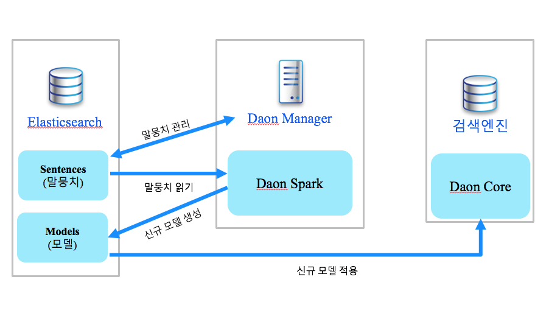

# Daon 형태소 분석기

말뭉치 기반 한글 형태소 분석기입니다.

elasticsearch, solr analyzer 지원, python 지원
 
### elasticsearch-plugin current version

Lucene : 7.2.1

Elasticsearch : 6.2.3

# Daon Elasticsearch Plugin Usage

[Daon Elasticsearch](daon-elasticsearch/README.md)

# Daon Manager Usage

[Daon Manager run on Docker](docker/README.md)

# Daon Core Usage

[Daon Core](daon-core/README.md)

# Daon Python

[Daon Python](https://github.com/rasoio/daon-python)

# System diagram

****

# 기초 데이터
 
## 세종 말뭉치  
[Rouzeta](https://shleekr.github.io/)에서 사용 된 수정된 세종 코퍼스입니다.

[https://ithub.korean.go.kr/user/member/memberPdsReferenceManager.do](https://ithub.korean.go.kr/user/member/memberPdsReferenceManager.do)

## NIADic

체언 사전만 사용

[https://kbig.kr/index.php?page=0&sv=title&sw=&q=knowledge/pds_&tgt=view&page=1&idx=16451&sw=&sv=title](https://kbig.kr/index.php?page=0&sv=title&sw=&q=knowledge/pds_&tgt=view&page=1&idx=16451&sw=&sv=title)

### 참고 문헌

[1] 신준철, 옥철영 (2012). 기분석 부분 어절 사전을 활용한 한국어 형태소 분석기. 정보과학회논문지 : 소프트웨어 및 응용, 39(5), 415-424.

[2] [http://blog.mikemccandless.com/2010/12/using-finite-state-transducers-in.html](http://blog.mikemccandless.com/2010/12/using-finite-state-transducers-in.html)

[3] [https://shleekr.github.io/](https://shleekr.github.io/)

[4] [https://bitbucket.org/eunjeon/](https://bitbucket.org/eunjeon/)

[5] [https://github.com/google/sentencepiece](https://github.com/google/sentencepiece)